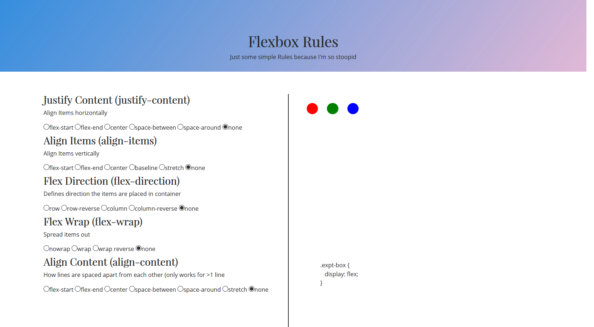
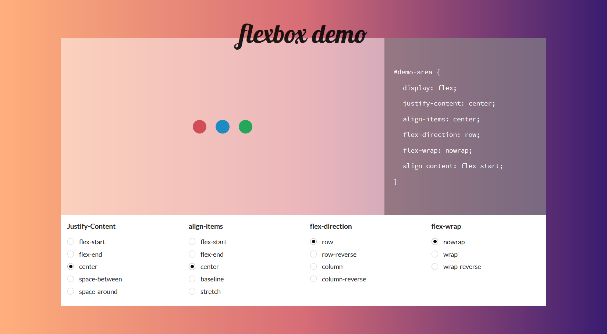

# flexbox-demo

Overhauling my first page built while learning web programming. You can view the old and gross page [here](https://kohrongying.github.io/chapalang/flexbox/). 

The new and hopefully less gross one [here](https://kohrongying.github.io/flexbox-demo/). Built to view on desktop/laptop, not optimized for mobile yet sed.

Built using [VueJS](https://vuejs.org/) which i ah-may-zing for such an application. The binding, the everything, is like so fast and shit. I know I'm kinda late and all but, better late than never right? 

Built with [Semantic UI](https://semantic-ui.com/) CSS Framework which I'm just experimenting as well. 

Background gradient from [uiGradients](https://uigradients.com/)

What should I build next?? 